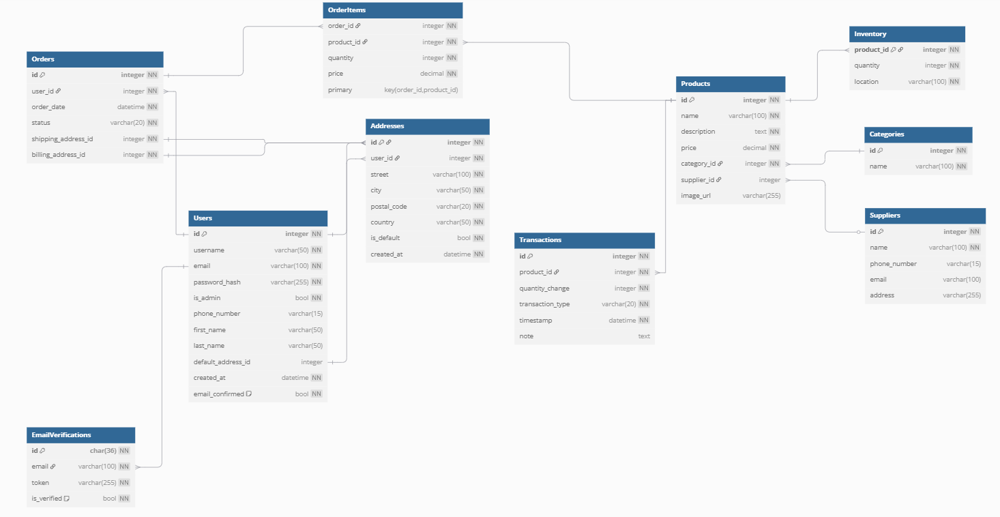

# Supermarket – System Zarządzania

## Struktura Bazy Danych

> **Uwaga:** Wymagane jest dodanie **API key** z aplikacji Google, aby możliwe było wysyłanie maili weryfikacyjnych.

Baza danych tworzona jest automatycznie przy uruchomieniu projektu, jednak początkowo nie zawiera żadnych danych.

Aby ją uzupełnić, można skorzystać z pliku `SQLInit.txt`, który zawiera:
- przykładowe dane startowe,
- triggery odpowiedzialne za:
  - **zmniejszanie ilości towaru w magazynie** po złożeniu zamówienia,
  - **oznaczanie adresu e-mail jako potwierdzonego** po pierwszym logowaniu użytkownika,
  - **rejestrowanie zmian stanów magazynowych** w tabeli `Transactions`.

---

## Technologie użyte w projekcie

- **Backend**:
  - [FastAPI](https://fastapi.tiangolo.com/) – tworzenie REST API,
  - [SQLAlchemy](https://www.sqlalchemy.org/) – obsługa bazy danych,
  - [Pydantic](https://docs.pydantic.dev/) – walidacja danych wejściowych/wyjściowych,
  - [PyJWT](https://pyjwt.readthedocs.io/) – generowanie i obsługa tokenów JWT.

- **Frontend**:
  - [React](https://reactjs.org/) – dynamiczny interfejs użytkownika,
  - korzysta z API udostępnianego przez backend.

---

## Funkcjonalność

### Klient:
- przeglądanie i dodawanie produktów do koszyka,
- składanie zamówień,
- podgląd statusu zamówienia.

### Sprzedawca:
- zarządzanie produktami,
- zarządzanie kategoriami i dostawcami,
- obsługa zamówień.

---

## Uwagi dodatkowe

- Projekt przedstawia model działania supermarketu z perspektywy **klienta** oraz **sprzedawcy**.
- System uwzględnia pełny przepływ zakupów: od dodania produktu do koszyka, przez realizację zamówienia, aż po aktualizację stanów magazynowych.
